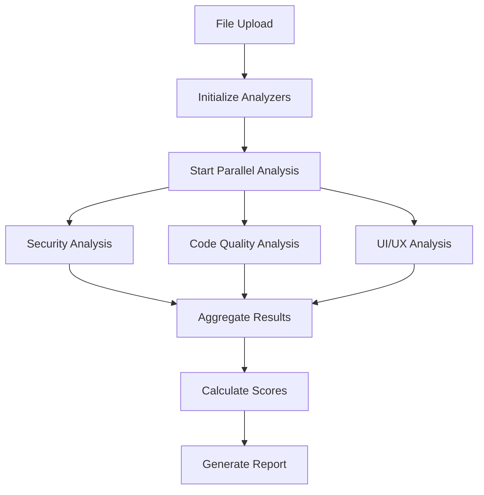

# 🎨 Canva App Reviewer

A comprehensive analysis tool for Canva apps that provides automated code quality assessment, security analysis, and UI/UX evaluation given a file.

Live prototype: http://13.211.45.190:3000

## 🏛️ System Architecture

### **📊 High-Level Architecture Overview**

```
┌───────────────────────────────────────────────────────────────────────────────┐
│                        FRONTEND (Next.js + TypeScript)                        │
├───────────────────┬───────────────────┬───────────────────┬───────────────────┤
│     User UI       │    API Client     │   Progress Bar    │   Report View     │
└───────────────────┴───────────────────┴───────────────────┴───────────────────┘
                                        │
                                  ┌─────▼─────┐
                                  │ REST API  │
                                  └─────┬─────┘
┌───────────────────────────────────────▼───────────────────────────────────────┐
│                        BACKEND CORE (FastAPI + Python)                        │
├───────────────────┬───────────────────┬───────────────────┬───────────────────┤
│   Orchestrator    │   File Handler    │  Progress Mgr     │   Data Store      │
└───────────────────┴───────────────────┴───────────────────┴───────────────────┘
                                        │
                          ┌─────────────▼─────────────┐
                          │     APP Analysis          │
                          │     (Parallel Phase)      │
                          └─────────────┬─────────────┘
                                        │
            ┌───────────────────────────┼───────────────────────────┐
            │                           │                           │
            ▼                           ▼                           ▼
┌───────────────────┐         ┌───────────────────┐         ┌───────────────────┐
│   SECURITY        │         │   CODE QUALITY    │         │     UI/UX         │
│   ANALYZER        │         │    ANALYZER       │         │    ANALYZER       │
│                   │         │                   │         │                   │
│ • Auth Patterns   │         │ • Performance     │         │ • Code Analysis   │
│ • Vulnerabilities │         │ • Maintainability │         │ • OpenCV Metrics  │
│ • Input Validation│         │ • Best Practices  │         │ • Screenshots     │
│ • Secure Coding   │         │ • Error Handling  │         │ • Design Guides   │
└───────────────────┘         └───────────────────┘         └───────────────────┘
            │                           │                           │
            │                           │                           │
            └───────────────────────────┼───────────────────────────┘
                                        │
                                ┌───────▼────────┐
                                │Prompt tailored │
                                │    to Canva    │
                                │   Guidelines   │
                                └───────┬────────┘
                                        │
                                ┌───────▼────────┐
                                │   CLAUDE 4     │
                                │ SONNET AI API  │
                                └───────┬────────┘
                                        │
                                ┌───────▼────────┐
                                │   SCORING &    │
                                │REPORT CREATION │
                                └────────────────┘
```


### **🔗 Component Interaction & Key Features**

**Frontend → Backend Communication:**
- `POST /upload` → File storage & validation
- `POST /analyze/{id}` → Trigger parallel analysis  
- `GET /status/{id}` → Real-time progress (polling every 2s)
- `GET /result/{id}` → Final analysis report

**Phase 1 - Multi-Dimensional Data Collection (Parallel):**

**🛡️ Security Analyzer** (30% weight): 
- Scans code for authentication patterns, vulnerabilities, input validation
- Identifies secure coding practices and potential security risks
- Detects SQL injection, XSS, CSRF vulnerabilities
- Evaluates dependency security and configuration issues

**⚙️ Code Quality Analyzer** (30% weight): 
- Evaluates performance metrics, maintainability scores
- Checks coding standards, error handling patterns
- Analyzes complexity, duplication, and technical debt
- Reviews best practices compliance and optimization opportunities

**🎨 UI/UX Analyzer** (40% weight): 
- **Code Analysis**: Checks accessibility patterns, component structure
- **OpenCV Metrics**: Calculates visual complexity, whitespace ratios, layout balance
- **Screenshot Capture**: Uses Playwright to generate visual representations
- **Accessibility**: WCAG 2.1 compliance checking and UX optimization
- Combines all three data sources for comprehensive UX evaluation

**Phase 2 - AI Analysis & Intelligent Scoring:**
- **🧠 Prompt Engineering**: Each analyzer's data formatted into specialized prompts
- **🤖 Claude 4 Sonnet**: Processes combined data with context-aware analysis
- **📊 Advanced Scoring**: Weighted algorithm with severity-based deductions
- **📋 Professional Reports**: Downloadable HTML reports with actionable insights

**Real-Time Progress & User Experience:**
- **Smooth Progress Bar**: Blue progress bar with granular updates (5% → 100%)
- **Live Status Messages**: Real-time updates during each analysis phase
- **Non-Decreasing Logic**: Prevents confusing progress drops (70% → 45%)
- **Professional UI**: Modern Next.js interface with Tailwind CSS styling
- **Report Download**: Comprehensive analysis reports for stakeholder sharing

## ✨ Additional Features

### 🎯 **Advanced Analysis Capabilities**
- **Multi-format File Support**: JavaScript, TypeScript, React components (.js, .jsx, .tsx, .ts)
- **Visual Screenshot Analysis**: Automated Playwright-based screenshot capture for UI components
- **Canva-Specific Guidelines**: Design system compliance checking tailored for Canva apps
- **Dependency Analysis**: Security vulnerability scanning for npm packages and dependencies

### 📊 **Professional Reporting System**
- **Executive Summary**: High-level insights with actionable recommendations
- **Detailed Issue Breakdown**: Categorized by severity (Critical, High, Medium, Low)
- **Downloadable Reports**: Professional HTML format suitable for stakeholder sharing
- **Visual Metrics Dashboard**: Charts and graphs showing analysis results and trends

### 🔧 **Developer Experience**
- **Fast Analysis**: Complete analysis typically completes in 5-10 seconds
- **Real-Time Feedback**: Progress updates every 2-3 seconds during processing
- **Modern UI**: Clean, responsive interface built with Next.js and Tailwind CSS
- **API Documentation**: Interactive Swagger docs available at `/docs` endpoint

### 🎨 **UI/UX Excellence**
- **Accessibility Focus**: WCAG 2.1 compliance checking and accessibility recommendations
- **Design Consistency**: Alignment with Canva's design principles and component patterns
- **Mobile Responsive**: Analysis covers responsive design patterns and mobile optimization
- **Color & Typography**: Design system adherence for consistent visual identity

## 🏗️ Project Structure

```
canva-app-reviewer/
├── 📁 frontend/                    # Next.js React Frontend
│   ├── 📁 app/                     # App Router Pages
│   │   ├── page.tsx                # Main application interface
│   │   ├── globals.css             # Global styling
│   │   └── layout.tsx              # Root layout component
│   ├── 📁 components/              # Reusable UI Components
│   │   ├── 📁 ui/                  # Base UI components
│   │   │   ├── button.tsx          # Button component
│   │   │   ├── progress.tsx        # Progress bar component
│   │   │   ├── card.tsx            # Card layouts
│   │   │   └── tabs.tsx            # Tab navigation
│   │   └── circular-progress.tsx   # Circular progress indicator
│   ├── 📁 lib/                     # Utility libraries
│   │   ├── api.ts                  # Backend API client
│   │   └── utils.ts                # Helper functions
│   ├── package.json                # Frontend dependencies
│   └── tailwind.config.js          # Tailwind CSS configuration
│
├── 📁 backend/                     # FastAPI Python Backend
│   ├── 📁 app/                     # Main application module
│   │   ├── 📁 api/                 # API route handlers
│   │   │   └── 📁 v1/              # API version 1
│   │   │       ├── analyze.py      # Analysis endpoints
│   │   │       └── upload.py       # File upload endpoints
│   │   ├── 📁 core/                # Core business logic
│   │   │   ├── 📁 analyzers/       # Analysis engines
│   │   │   │   ├── base_analyzer.py         # Abstract analyzer base
│   │   │   │   ├── security_analyzer.py     # Security analysis
│   │   │   │   ├── code_quality_analyzer.py # Code quality analysis
│   │   │   │   └── ui_ux_analyzer.py        # UI/UX analysis
│   │   │   ├── analysis_orchestrator.py     # Parallel analysis coordinator
│   │   │   └── file_handler.py              # File processing utilities
│   │   ├── 📁 models/              # Data models and schemas
│   │   │   └── response.py         # API response models
│   │   ├── 📁 utils/               # Utility modules
│   │   │   ├── js_screenshot_utils.py       # Screenshot capture system
│   │   │   └── filename_mapping.py          # File naming utilities
│   │   ├── 📁 tests/               # Test suites
│   │   │   └── test_analysis.py    # Analysis testing
│   │   ├── config.py               # Application configuration
│   │   └── main.py                 # FastAPI application entry
│   ├── requirements.txt            # Python dependencies
│   └── 📁 uploads/                 # File upload storage
│
├── 📁 docs/                        # Documentation
│   ├── PROGRESS_BAR_IMPROVEMENTS.md    # Progress tracking improvements
│   └── FINAL_PROGRESS_BAR_SOLUTION.md  # Complete progress solution
│
├── .env.example                    # Environment variables template
├── .gitignore                      # Git ignore rules
└── README.md                       # This file
```

## 🚀 Quick Start

### Prerequisites

- **Node.js** 18+ and npm/yarn
- **Python** 3.8+ with pip
- **Claude API Key** from Anthropic

### 1. Clone Repository

```bash
git clone <repository-url>
cd canva-app-reviewer
```

### 2. Backend Setup

```bash
cd backend

# Create virtual environment
python -m venv venv
source venv/bin/activate  # On Windows: venv\Scripts\activate

# Install dependencies
pip install -r requirements.txt

# Configure environment
cp ../.env.example .env
# Edit .env with your Claude API key: CLAUDE_API_KEY=your_api_key_here

# Start backend server
uvicorn app.main:app --reload --host 0.0.0.0 --port 8000
```

### 3. Frontend Setup

```bash
cd frontend

# Install dependencies
npm install

# Start development server
npm run dev
```

### 4. Access Application

- **Frontend**: http://localhost:3000
- **Backend API**: http://localhost:8000
- **API Documentation**: http://localhost:8000/docs

## 📖 Usage Guide

### 1. **Upload File**
- Drag & drop or select a file (.js, .jsx, .tsx, .ts)
- Supported file types: JavaScript, TypeScript, React components
- Maximum file size: 10MB

### 2. **Monitor Analysis**
- Real-time progress updates from 5% to 100%
- Progress messages show current analysis stage:
  - `Initializing analyzers...` (5%)
  - `Starting Security, Code Quality, and UI/UX analysis...` (10%)
  - `Running Security analysis...` (15-40%)
  - `Running Code Quality analysis...` (40-65%)
  - `Running UI/UX analysis...` (65-90%)
  - `Aggregating analysis results...` (92%)
  - `Calculating final scores...` (95%)
  - `Analysis completed successfully` (100%)

### 3. **Review Results**
- **Overall Score**: Weighted average of all categories
- **Category Breakdown**: Individual scores for Security, Code Quality, UI/UX
- **Issue Details**: Categorized by severity with recommendations
- **Executive Summary**: High-level insights and next steps

### 4. **Download Report**
- Professional HTML report with complete analysis
- Includes issue breakdown, recommendations, and metrics
- Suitable for sharing with stakeholders

## 🔧 Technical Architecture

### **Frontend Stack**
- **Framework**: Next.js 14 with App Router
- **Language**: TypeScript
- **Styling**: Tailwind CSS
- **UI Components**: Custom component library
- **State Management**: React hooks and context

### **Backend Stack**
- **Framework**: FastAPI (Python)
- **AI Integration**: Claude 4 Sonnet via Anthropic API
- **Screenshot System**: Playwright with custom JavaScript execution
- **File Processing**: Multi-format support with metadata extraction
- **Architecture**: Modular analyzer pattern with parallel execution

### **Analysis Engine**

#### **Security Analyzer**
- Authentication and authorization patterns
- Input validation and sanitization
- Secure coding practices
- Dependency vulnerability scanning

#### **Code Quality Analyzer**
- Performance optimization opportunities
- Code maintainability metrics
- Best practices compliance
- Error handling patterns

#### **UI/UX Analyzer**
- Accessibility compliance (WCAG 2.1)
- Canva design system alignment
- Visual design assessment via screenshots
- Mobile responsiveness evaluation
- User experience optimization

### **Scoring Algorithm**

```python
Base Score: 100 points

Deductions per issue:
- Critical: -20 points
- High: -10 points
- Medium: -5 points
- Low: -2 points

Diminishing returns: 
If deductions > 50, apply: 50 + (excess * 0.5)

Final Score: max(0, base_score - total_deductions)
```

### **Parallel Analysis Flow**



## 🎯 Recent Improvements

### ✅ **Progress Bar Enhancements**
- **Visual**: Changed color from black to blue for better aesthetics
- **Accuracy**: Implemented granular progress tracking (11 updates vs 4 previously)
- **Reliability**: Added non-decreasing progress logic for parallel execution
- **UX**: Eliminated confusing progress decreases (70% → 45%)

### ✅ **Scoring System Fixes**
- **UI/UX Scoring**: Fixed critical bug where UI/UX analyzer returned 0 score
- **Calculation**: Proper score calculation now reflects issue severity and count
- **Consistency**: All analyzers use the same scoring methodology

### ✅ **User Experience**
- **Messages**: Fixed capitalization ("Ui Ux" → "UI/UX")
- **Feedback**: Clear progress messages for each analysis stage
- **Performance**: Optimized parallel execution with real-time updates

## 🧪 Testing

### Run Backend Tests
```bash
cd backend
python -m pytest app/tests/ -v
```

### Test Analysis Flow
```bash
# Test progress tracking
python test_improved_progress.py

# Test scoring system
python -c "from app.core.analyzers.ui_ux_analyzer import UIUXAnalyzer; print('✅ UI/UX Analyzer ready')"
```

## 🔧 Configuration

### Environment Variables
```bash
# Backend (.env)
CLAUDE_API_KEY=your_anthropic_api_key
UPLOAD_DIR=uploads
MAX_FILE_SIZE=10485760  # 10MB
SUPPORTED_FILE_TYPES=.js,.jsx,.tsx,.ts
LOG_LEVEL=INFO
```

### Customization
- **Scoring Weights**: Modify `SCORING_WEIGHTS` in `analysis_orchestrator.py`
- **File Types**: Update `SUPPORTED_FILE_TYPES` in configuration
- **UI Themes**: Customize Tailwind configuration in `tailwind.config.js`

## 📊 Performance Metrics

- **Analysis Speed**: ~5-10 seconds per file
- **Parallel Execution**: 3 analyzers run simultaneously
- **Progress Updates**: Every 2-3 seconds during Claude API calls
- **Screenshot Capture**: ~1-2 seconds for visual analysis
- **Report Generation**: Near-instantaneous

## 🤝 Contributing

1. Fork the repository
2. Create a feature branch (`git checkout -b feature/amazing-feature`)
3. Commit changes (`git commit -m 'Add amazing feature'`)
4. Push to branch (`git push origin feature/amazing-feature`)
5. Open a Pull Request

## 📄 License

This project is licensed under the MIT License - see the LICENSE file for details.


**Built with ❤️ for the Canva developer community** 